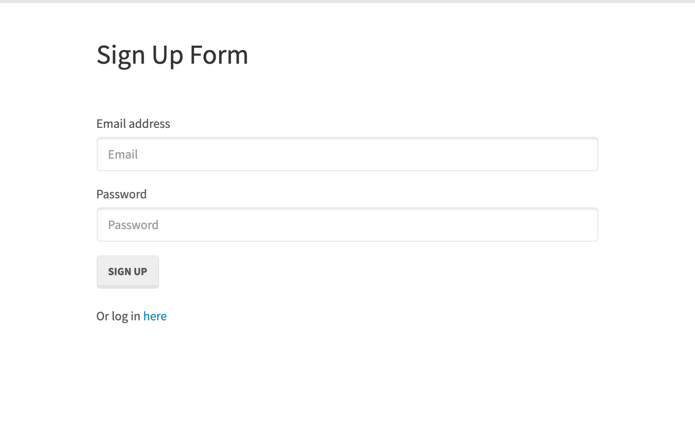
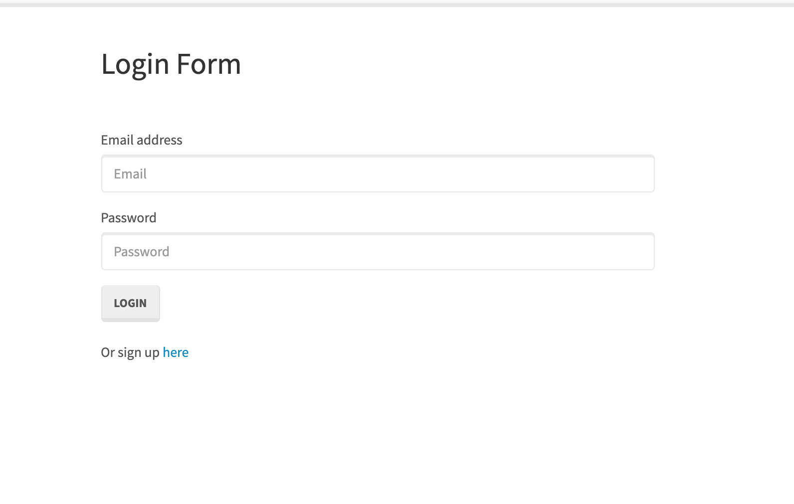
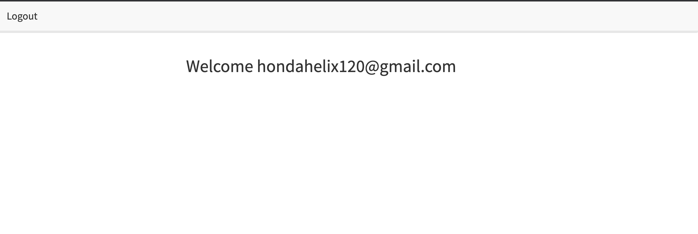
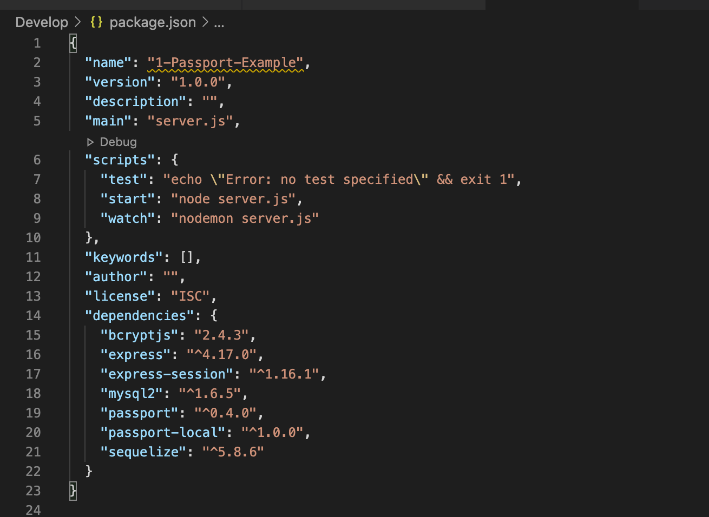
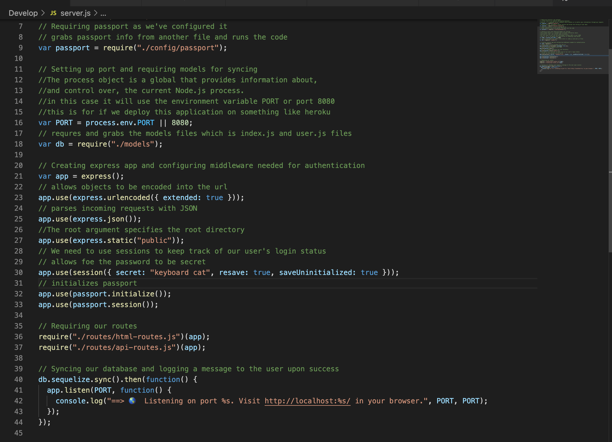
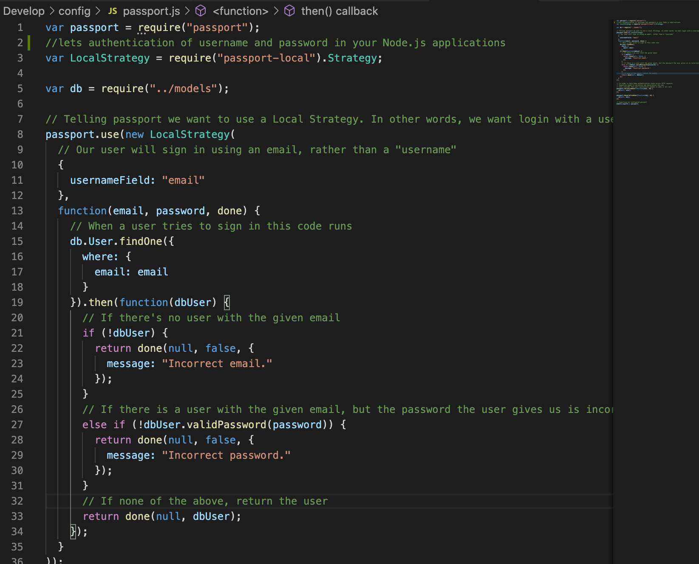
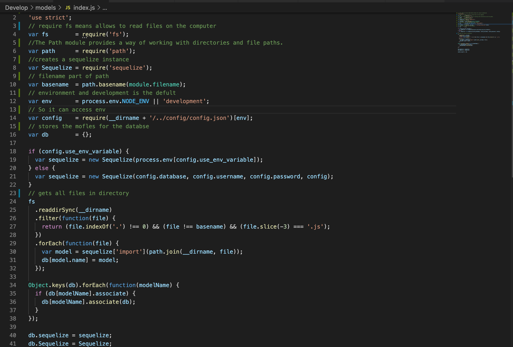
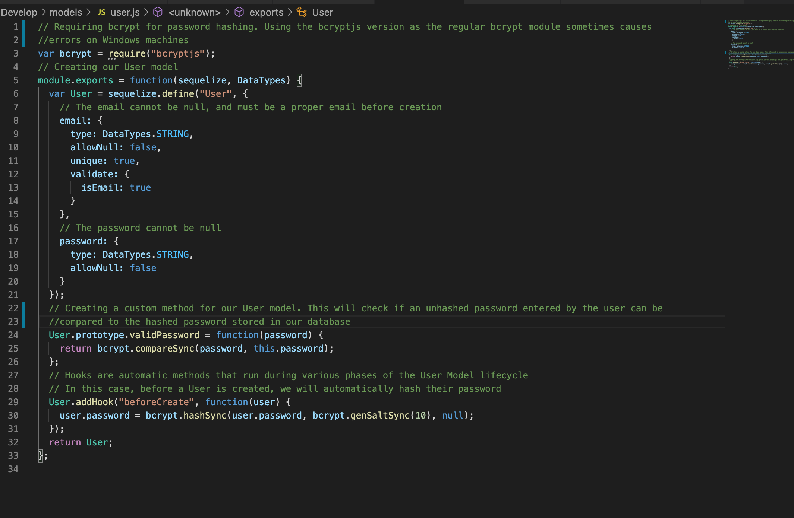
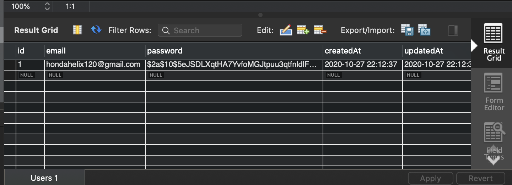
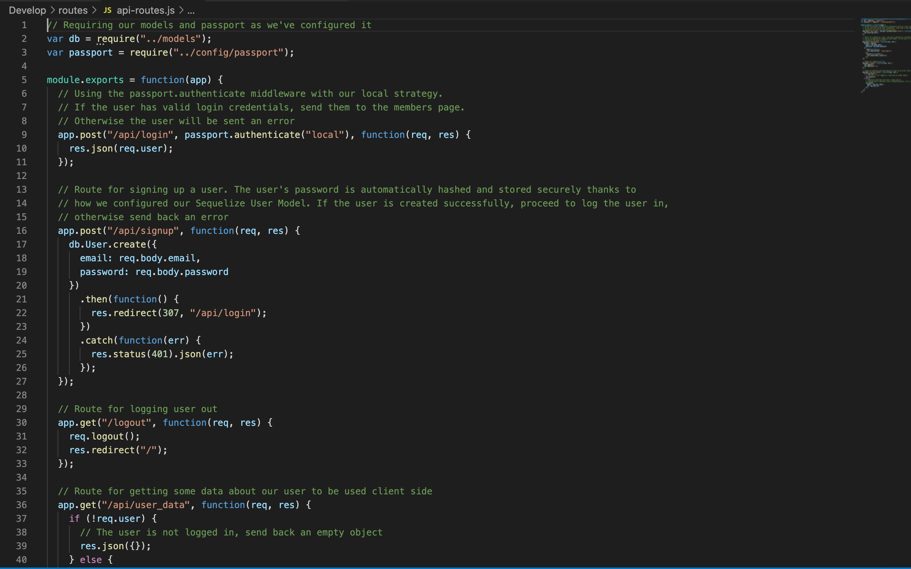

# passport-walkthrough

## Description 

This is a walkthrough of an Node.js application that utilizes Sequelize and Passport to authenticate users and allow them to log in. This application is a great starting point for a new project because it enables any developer to enable personalized content for their users by securing personalized data based on their own account information.

## Table of Contents
* [Installation](#installation)
* [Usage](#usage)
* [Walkthrough](#walkthrough)
* [Credits](#credits)
* [License](#license)

   
## Installation

The installation of this project is to access my github repository and then click on note-taker or click this link [passport-walkthrough](https://github.com/hondahelix/passport-walkthrough) then click on the green code button in the top right corner. Then you can copy and paste the code via ssh or by downloading a zip file.

## Usage 

The usage of this walkthrough aims to enable a developer to be able to understand the code so that they can have a starting point for a new project that enables a secure login for their website. When started the application will take you to a sign up page. If the user has already signed up then they will click on the log in page in order to enter their password and email.

If the user successfully logs in then they are taken to the members page.

## Walkthrough

### package.json

An integral part of understanding the code is to understand what dependencies this application needs for it to function properly. Following are the dependencies of this application as well as a brief outline of what they are used for.

Bcryptjs: A library to help you hash passwords. [bcrypt.js](https://www.npmjs.com/package/bcryptjs) 

Express: Web application server framework. [express](https://www.npmjs.com/package/express)

Express-session: assigned a unique session, and this allows you to store the user state. [express-session](https://www.npmjs.com/package/express-session)

Mysql2: Relational database management system based on SQL. [mysql2](https://www.npmjs.com/package/mysql2)

Passport: Used to authenticate requests. [passport](https://www.npmjs.com/package/passport)

Passport-local: Lets authentication using a username and password in node.js. [passport-local](https://www.npmjs.com/package/passport-local)

Sequelize:  Promise-based Node.js ORM which lets two incompatible systems to work together in our case it enables us to interact with the database. [Sequelize](https://sequelize.org)

### Server.js

This file utilizes express in order to create a server and start it up in localhost. This file also syncs the database and configures the application.

### Config

The config folder contains the different config.json file that lets the application know the different environments that it should run in. 

#### passport.js

The passport.js file authenticates the imputed username which is the email and also the password to make sure that they are valid inputs found in the database. If the username was imputed incorrectly the user will be notified that they have imputed an incorrect email/username and if they have a right username but wrong password that corresponds with the email then it will notify the user by sending a message of incorrect password.  

#### isAuthenticated.js

The isAuthenticated.js file is in the middleware folder found in the config folder and handles if the user is logged in or not.  If the user is not logged in then they will be redirected to the login page and if the user is logged in then it will send them to the membership page. 

### Models

The model folder has the necessary files in order to connect to the database.

#### index.js

This file gets all the models from the directory that it is in and associates them where they need to go.

#### user.js

This file utilizes sequelize in order to connect to the database and create a table containing  the users username as well as the password. This file also utilizes bcrypt in order to hash the password before it is stored so that the passwords are secure.

This is an example of the hashed password in the database.

### Public

The public folder contains all the files shown to the user such as the html, js and css files.

#### html

The html files are used to display and structure the webpage to the user whether it be the login page, sign up page or the members page.

#### js

The js files login.js, members.js and signup.js enable the application to grab the input from the users and then sends it via a request to be handled in the routes files. 

#### stylesheets

This folder handles all the styles of how the html is displayed to the user. This includes placement, color and text.

### Rotes

The routes folder contains all the code that handles requests and responses from the user and the server. This can be thought of as a bridge from the frontend to the backend. 

#### api-routes.js

The api-routes.js file handles what the user is trying to do whether it be log in, signup, logout. 

#### html-routes.js

The html-routes handles redirecting the user to the proper page. For example if the user is not signed in it will redirect them to the sign in page and if they are then it will send them to the members page. 

## How To Add Changes

Changes to this code that can be utilized by a developer can be as easy as modifying the members.html file in order to send them to their own desired website. This can be accomplished by modifying the html.routes.js to send them to their desired page rather than the members. This can be done by changing the get function on line 27 from “/members” to their own desired page that is added to the public file. An even simpler way for a developer to change how the page looks is by modifying the html or the css in the public folder.  

   
## Credits

application and instruction was provided by the University of California Berkeley' full stack Coding Bootcamp program.

[UCB Coding Bootcamp](https://bootcamp.berkeley.edu/coding/)   

## License

 MIT

## Badges

## Contact 

[Github](https://github.com/hondahelix)  
